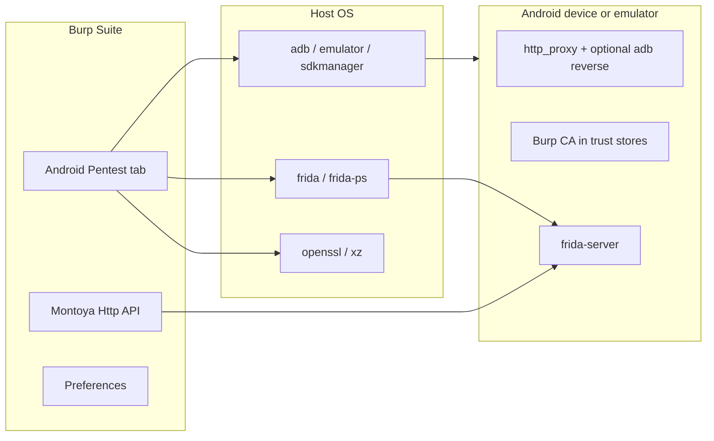
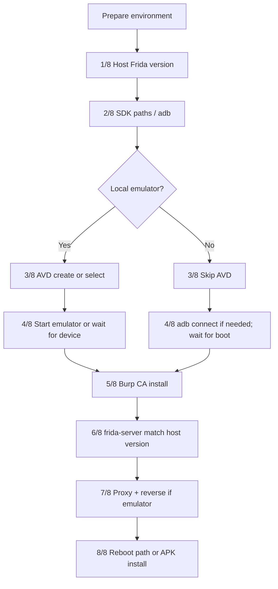
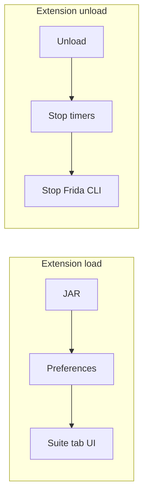

# Android Pentest — Burp Suite Extension

A [Burp Suite](https://portswigger.net/burp) extension built with the **Montoya API** that helps you prepare an **Android emulator or physical device** for web and mobile security testing: it aligns the device with Burp’s **proxy listener**, installs Burp’s **CA certificate** (when you provide a `.der` export), deploys **`frida-server`** on the device, and runs **Frida CLI** sessions with your local `.js` scripts.

**Use only on systems and applications you are authorized to test.**

---

## Table of contents

1. [For PortSwigger reviewers (BApp Store)](#for-portswigger-reviewers-bapp-store)
2. [What this extension does and does not do](#what-this-extension-does-and-does-not-do)
3. [Architecture at a glance](#architecture-at-a-glance)
4. [Requirements](#requirements)
5. [Build](#build)
6. [Install in Burp](#install-in-burp)
7. [Quick start](#quick-start)
8. [Connection modes](#connection-modes)
9. [Prepare environment (pipeline)](#prepare-environment-pipeline)
10. [Proxy port sync](#proxy-port-sync)
11. [Burp CA and HTTPS interception](#burp-ca-and-https-interception)
12. [Frida (host and device)](#frida-host-and-device)
13. [Frida scripts and “List apps”](#frida-scripts-and-list-apps)
14. [Optional APK install](#optional-apk-install)
15. [Troubleshooting](#troubleshooting)
16. [License and related files](#license-and-related-files)

---

## For PortSwigger reviewers (BApp Store)

This section is written so reviewers can quickly judge scope, dependencies, and overlap with existing BApps.

| Topic | Details |
|--------|---------|
| **API** | Montoya (`compileOnly` `montoya-api:2024.12`), Java 17. Entry: `burp.api.montoya.BurpExtension` via `META-INF/services`. |
| **What ships in the JAR** | Extension logic only. **Not** bundled: Android SDK tools, Frida CLI, `openssl`, `xz`, system images. |
| **Network** | First-time runs may download SDK components (`sdkmanager`) and **`frida-server`** from GitHub. The latter uses **`Http.sendRequest`** with **redirect following** (`RequestOptions` / `RedirectionMode.ALWAYS`) so Burp’s upstream proxy and TLS settings apply. |
| **Threads / UI** | Long work runs off the Swing EDT; unload handler stops timers and Frida processes. |
| **Differentiation from [Brida](https://portswigger.net/bappstore/2c0def96c5d44e159151b236de766892)** | Brida is a **Burp ↔ Frida bridge** (hooks, traffic integration, multi-platform). **Android Pentest** automates **lab setup**: AVD/emulator or ADB device, proxy alignment, CA installation, `frida-server` deployment, and **local Frida CLI** (`frida` / `frida-ps`). It does **not** replace Brida’s in-Burp scripting model. More wording: [BAPP_SUBMISSION.md](BAPP_SUBMISSION.md). |
| **Submission checklist / email template** | [BAPP_SUBMISSION.md](BAPP_SUBMISSION.md), [SUBMIT_PORTSWIGGER.md](SUBMIT_PORTSWIGGER.md). Official process: [Submitting extensions to the BApp Store](https://portswigger.net/burp/documentation/desktop/extend-burp/extensions/creating/bapp-store-submitting-extensions). Acceptance criteria: [BApp Store acceptance criteria](https://portswigger.net/burp/documentation/desktop/extend-burp/extensions/creating/bapp-store-acceptance-criteria). |
| **License** | [LICENSE](LICENSE) (MIT). |

**Offline / air-gapped labs:** users must pre-install SDK images and `frida-server` manually; the extension expects normal connectivity when automated downloads are required.

---

## What this extension does and does not do

**Does:**

- Reads Burp’s **proxy listener port** from Burp settings and keeps the Android **global HTTP proxy** in sync (including a periodic refresh).
- **Local emulator:** can create or reuse an AVD, start the emulator with `-http-proxy` toward `127.0.0.1:<BurpPort>`, use **`adb reverse`** so the guest can reach Burp on localhost.
- **Physical device:** can `adb connect` (optional), set the device proxy to your **LAN IP** and Burp’s port.
- Installs Burp’s CA (`.der`) for system / APEX / user stores where supported (see [Burp CA and HTTPS interception](#burp-ca-and-https-interception)).
- Ensures **`frida-server` on the device matches the host `frida` version** (semver); downloads and pushes when needed (Unix-like hosts; Windows requires manual binary placement — see [Requirements](#requirements)).
- Runs **`frida`** / **`frida-ps`** from the host with an extended `PATH` (macOS/Linux shells) so tools work even when Burp’s process has a minimal environment.

**Does not:**

- Replace Brida-style **in-Burp** Frida integration or method hooking on HTTP messages.
- Bypass **certificate pinning** or custom HTTP stacks by itself — use your Frida scripts or other tooling.
- Guarantee full automation on **Windows** (documented limitations).

---

## Architecture at a glance



On load, the extension registers a **suite tab**, loads settings from **Preferences**, and applies Burp’s theme to the UI. On unload, it stops background timers and terminates any running Frida CLI process.

---

## Requirements

### Burp Suite

- Burp with **Montoya** extension support (**2022.x or newer** recommended).
- A **Proxy listener** enabled (the extension resolves its port from Burp’s configuration).

### Build (developers)

- **JDK 17+**
- **Gradle** (project has no wrapper; use your installed `gradle`)

### Android SDK (`ANDROID_HOME`)

| Component | Purpose |
|-----------|---------|
| **Platform-Tools** | `adb` |
| **Command-line Tools** | `sdkmanager`, `avdmanager` (create AVD / download system images) |
| **Emulator** | QEMU binary (Android Strudio)— **only for “Local emulator” mode** |

Typical locations:

- macOS: `~/Library/Android/sdk`
- Windows: `%LOCALAPPDATA%\Android\Sdk`
- Linux: `~/Android/Sdk` (common)

Set **ANDROID_HOME** in the extension UI to your SDK root.

**System images:** the UI can list Google APIs images (e.g. `arm64-v8a` / `x86_64`). First run may download an image via `sdkmanager`. Non–Play Store “Google APIs” images are preferred for `adb root` / system CA workflows.

### Frida (host)

Install **frida-tools** so `frida` and `frida-ps` are available (same machine as Burp):

```bash
pip install frida-tools
# or: pipx install frida-tools
```

The extension runs `frida --version` to choose the matching **`frida-server`** build for the device.

### Host utilities (macOS / Linux)

| Tool | Role |
|------|------|
| **openssl** | CA conversion / hashing for installation on the device |
| **xz** | Decompress the `.xz` `frida-server` archive after download |
| **Burp HTTP (Montoya)** | Download `frida-server` from GitHub through Burp (follows redirects, respects Burp networking) |

Install missing tools via your package manager (e.g. Homebrew on macOS).

### Windows

- **`adb`**, **`emulator`**, **`sdkmanager`** must be on a `PATH` visible to **`cmd.exe`**.
- Automatic **`frida-server`** download/decompression is **not** fully supported; you may need to push `frida-server` manually to `/data/local/tmp/frida-server` and match versions to the host `frida`.
- For the full automated flow, **WSL**, **macOS**, or **Linux** are recommended.

### Physical device (optional)

- USB debugging enabled, or `adb connect host:port` for wireless ADB.
- Phone and Burp machine on the **same network** when using **LAN IP** for the proxy.

### ABI note

The automated `frida-server` fetch targets **Android arm64** by default. Other ABIs may require a **manual** binary.

---

## Build

```bash
cd burp-android-pentest
gradle jar
```

Output: `build/libs/android-pentest-extension-1.0.0.jar` (version follows `build.gradle.kts`).

---

## Install in Burp

1. **Extensions** → **Installed** → **Add**.
2. Extension type: **Java**.
3. Select `build/libs/android-pentest-extension-1.0.0.jar`.
4. Open the **Android Pentest** suite tab.

---

## Quick start

1. Configure a **Proxy** listener in Burp (e.g. `127.0.0.1:8080`).
2. In **Android Pentest**, choose **Local emulator** or **Physical device** and fill **ANDROID_HOME**, optional **Burp CA (.der)** path, and **Frida scripts** folder.
3. Click **Save settings** if you want preferences persisted.
4. Click **Prepare environment** and watch the log (`[1/8]` … `[8/8]`).
5. Use **List apps** to pick a package, select scripts, then **Run Frida** (Spawn or Attach).

---

## Connection modes

| Mode | Summary |
|------|---------|
| **Local emulator** | Uses an AVD; emulator gets `-http-proxy http://127.0.0.1:<BurpPort>`. Guest traffic uses **`adb reverse tcp:<port> tcp:<port>`** and **`settings put global http_proxy 127.0.0.1:<port>`** so apps using the system proxy can reach Burp. |
| **Physical device** | USB or wireless ADB. Set **Pentest machine IP** to this computer’s IPv4 on the LAN; the device proxy uses **`IP:<BurpPort>`** (no `adb reverse` for that path). |

For **Frida over TCP** (`frida -H`), enable **Frida client uses network (-H)** and, on the device side, **Deploy frida-server listening on 0.0.0.0** when required.

---

## Prepare environment (pipeline)

When you click **Prepare environment**, the extension resolves the listener port (`BurpProxyHelper`), then runs an eight-step pipeline (logged as `[1/8]` … `[8/8]`).

**Local emulator only:** step `[8/8]` may **`adb reboot`** the emulator, then re-apply CA, reverse, proxy, Frida, and optionally **`adb install -r`** for your APK (tmpfs/APEX-related state is not always persistent across reboot).

**Physical device:** no emulator reboot path; optional APK install runs at the end of the first pass.





---

## Proxy port sync

Every **15 seconds**, if `adb devices` shows a device, the extension re-applies the same **`http_proxy`** logic so if you **change Burp’s listener port**, the device catches up without re-running the full pipeline. For **local emulator**, it also runs **`adb reverse tcp:<port> tcp:<port>`** before setting the proxy.

---

## Burp CA and HTTPS interception

1. Export Burp’s CA as **DER** (**Proxy** → import/export CA certificate) and set the path in the UI.

2. **Android 14 (API 34) and newer** often load default CAs from the **Conscrypt** module under paths such as **`/apex/com.android.conscrypt/cacerts`**. Installing only into **`/system/etc/security/cacerts`** may be insufficient. The extension attempts a **tmpfs overlay** and **bind-mount** approach for Conscrypt paths after `adb root`, with fallbacks documented in code and logs.

3. The pipeline may also install user-store copies so **Settings → Security → Trusted credentials → User** can show entries; a **reboot** on the emulator may be needed for the UI to reflect changes — the post-reboot phase re-applies proxy and Frida because tmpfs mounts do not survive reboot.

4. **Chrome** and some apps may still behave differently (e.g. certificate transparency). Many apps using the platform TLS stack work once the CA is trusted.

5. Apps that **ignore the global HTTP proxy** (e.g. OkHttp defaults) may need Frida hooks or other routing; Burp will not see that traffic until it is redirected.

---

## Frida (host and device)

- **Version match:** the extension compares the host `frida --version` (semver) with `/data/local/tmp/frida-server --version` on the device. If they differ, it stops a running `frida-server` when necessary, downloads the matching **arm64** build via **Burp’s HTTP API** (redirects enabled), decompresses with **`xz`**, pushes to `/data/local/tmp/frida-server`, and verifies the version again before starting the server.
- **Windows:** if versions do not match, you must place the correct binary manually (error messages explain this).

---

## Frida scripts and “List apps”

- Set **Frida scripts folder** to a directory containing `*.js` files. Each file appears as a checkbox; selected scripts are passed as multiple **`-l`** arguments in **alphabetical order**.
- **List apps** runs **`frida-ps -Uai`** or **`frida-ps -H host:port -ai`** and shows a dialog (table + raw output). **Double-click** a row to fill **Package / target**.
- **Run Frida** invokes the **`frida`** CLI with **Spawn** or **Attach** and streams stdout/stderr into the tab. A one-line **REPL** field can send JavaScript to the process stdin when supported.

---

## Optional APK install

Set **APK to install** (or browse) to run **`adb install -r`** after the pipeline stabilizes (after reboot on emulator, or at end of first pass on a physical device). Leave empty to skip.

---

## Troubleshooting

| Symptom | What to check |
|---------|----------------|
| **Tools not found** (`frida`, `xz`, `openssl`) | Burp’s process may have a minimal `PATH`. On macOS/Linux the extension widens `PATH` via shell; install tools in standard locations (Homebrew, `~/.local/bin`). On Windows, ensure tools are on the `cmd.exe` PATH. |
| **Burp port not detected** | **Proxy → Proxy settings**: listener enabled, correct interface/port. |
| **HTTPS still fails in apps** | Confirm Prepare log shows **VERIFY OK** for APEX Conscrypt paths where applicable; re-run Prepare. Consider pinning / custom TLS. |
| **frida-server download fails** | Corporate proxy / TLS: requests go through Burp’s stack — check Burp **Network** settings. GitHub may redirect (302); the extension follows redirects. |
| **Windows** | Expect manual `frida-server` steps; use WSL or Unix for parity with the automated path. |

---

## License and related files

- **License:** [LICENSE](LICENSE)

---

*Extension name in Burp UI: **Android Pentest** · Package: `com.mobilepentest.burp` · Artifact: `android-pentest-extension-1.0.0.jar`*
