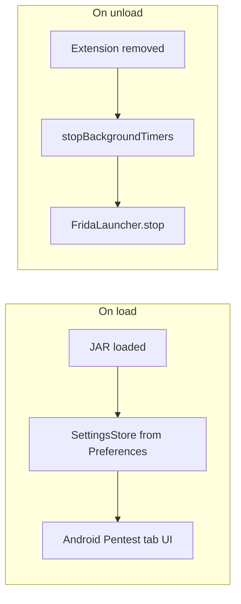
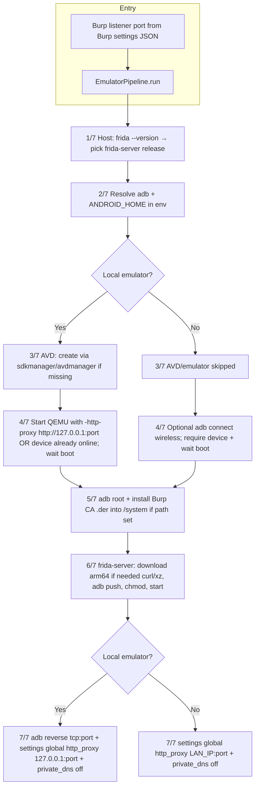
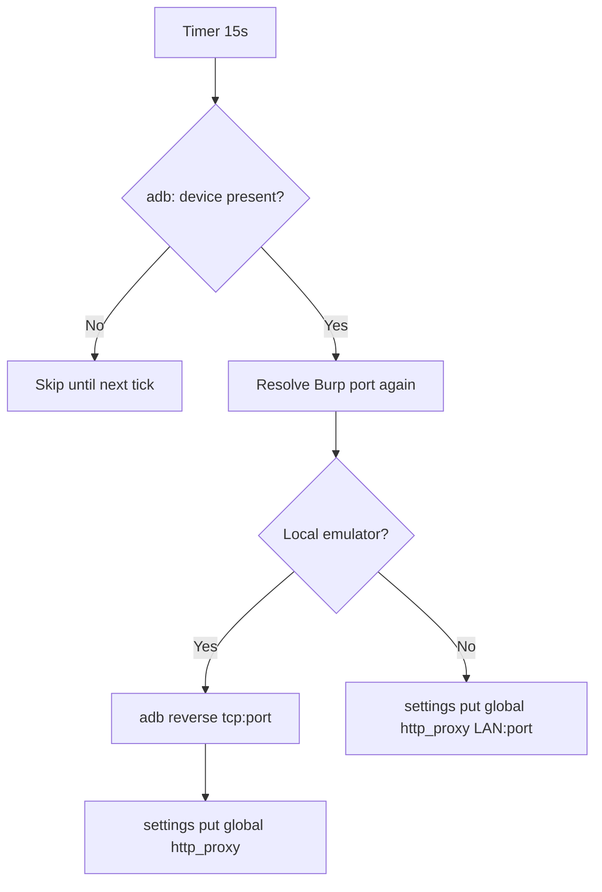
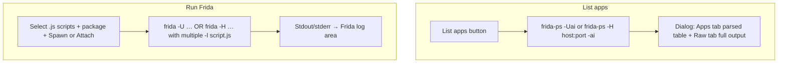

# Burp Suite extension: Android pentest (emulator + Frida)

A **Burp Suite** extension (Montoya API) that automates preparing an **Android** target aligned with Burp’s **proxy listener**, installs the **Burp CA** into `/system` when a `.der` file is provided, deploys **frida-server** on the device, and runs **Frida scripts** from a configurable folder.

**Default target:** local **Android Studio AVD**. The emulator QEMU process uses `-http-proxy http://127.0.0.1:BurpPort` (host loopback). Inside the guest, **`adb reverse tcp:port tcp:port`** plus **`settings global http_proxy 127.0.0.1:port`** sends app HTTP(S) via Burp (Burp can listen on `127.0.0.1` only). Apps with **certificate pinning** or **custom stacks** may still bypass the system proxy — use Frida scripts / device tools as needed.

**Optional:** **physical device** (USB or `adb connect IP:port`) using your workstation’s **LAN IP** so the phone can reach Burp.

**For authorized security testing only.**

## Requirements

### Burp Suite

- **Burp Suite** with **Montoya** extension support (Burp **2022.x** or newer recommended).
- **JDK 17+** on the workstation to build the extension (`gradle jar`).
- A **proxy listener** configured in Burp (the extension reads the listener port from Burp’s settings).

### Android Studio / Android SDK

Install **Android Studio** (or use the **standalone command-line tools** only) so that **`ANDROID_HOME`** points to a valid SDK. The extension expects at least:

| Component | Purpose |
|-----------|---------|
| **Android SDK Platform-Tools** | `adb` (devices, shell, push, install certificate, `frida-server`, etc.) |
| **Android Emulator** (optional) | QEMU binary — only required for **Local emulator** mode |
| **Android SDK Command-line Tools** (latest) | `sdkmanager` / `avdmanager` — first-time system image download and AVD creation |

Typical paths:

- **macOS:** `~/Library/Android/sdk` (Android Studio default)  
- **Windows:** `%LOCALAPPDATA%\Android\Sdk`  
- **Linux:** `~/Android/Sdk` (common default)

Set **`ANDROID_HOME`** in the extension tab to that SDK root (or rely on the usual Android Studio layout).

**Local emulator** mode also needs a **system image** (e.g. `system-images;android-34;google_apis;arm64-v8a` — default in the extension; matches **Apple Silicon** / **arm64** emulators). The first **Prepare environment** run may download it via `sdkmanager`.

### Frida (host)

Install the **Frida CLI** on the host machine (same machine that runs Burp):

- **`frida-tools`** (Python package) provides **`frida`**, **`frida-ps`**, and matches the Frida version used to download **`frida-server`** for the device.

Example:

```bash
pip install frida-tools
# or: pipx install frida-tools
```

Ensure `frida` and `frida-ps` resolve from a terminal. On macOS/Linux the extension runs them via a non-interactive shell with an extended `PATH` (Homebrew, `~/.local/bin`, etc.) so Burp’s GUI process can find them too.

### Host utilities (macOS / Linux)

Used by the **Prepare environment** pipeline (certificate handling, downloading `frida-server`):

| Tool | Role |
|------|------|
| **`openssl`** | Convert / hash the Burp CA (`.der`) when installing into `/system` on the device |
| **`curl`** | Download `frida-server` from GitHub releases |
| **`xz`** | Decompress the `.xz` `frida-server` archive |

On **macOS**, `curl` is built-in; **`openssl`** and **`xz`** are often installed via **Homebrew** (`brew install xz openssl` if missing).

On **Linux**, install the corresponding packages from your distribution (`xz-utils`, `openssl`, `curl`).

### Windows

- **`adb`**, **`emulator`**, **`sdkmanager`** must be on a `PATH` visible to **`cmd.exe`** when the extension runs subprocesses.
- Automatic download/decompression of **`frida-server`** is **not** fully supported in the pipeline; you may need to push `frida-server` manually to `/data/local/tmp/` on the device.
- Prefer **WSL** or **macOS/Linux** for the full “one click” flow.

### Physical device (optional)

- **USB debugging** enabled on the phone, or **`adb connect host:port`** for wireless debugging.
- Same network as the Burp machine when using **LAN IP** for the proxy (no `adb reverse` requirement for that path).

### Version / ABI notes

- **`frida-server`** downloaded by the pipeline targets **Android arm64** by default; other ABIs may need a **manual** binary.
- If Burp’s **automatic listener port** detection fails, check **Proxy → Proxy settings** (listener enabled and port).

## Build

```bash
cd burp-android-pentest
gradle jar
```

Output: `build/libs/android-pentest-extension-1.0.0.jar`.

## Install in Burp

1. **Extensions** → **Extensions** → **Add**.
2. Type **Java**.
3. Select `build/libs/android-pentest-extension-1.0.0.jar`.
4. Open the **Android Pentest** tab.

## Flow overview

The extension registers a **suite tab** (`Android Pentest`), persists settings via Montoya **Preferences**, reads Burp’s **proxy listener port** from exported user options, and runs subprocesses (`adb`, `emulator`, `frida`, `curl`, `xz`, `openssl`) through a **non-interactive shell** with an extended `PATH` (see Notes). On unload it stops the **proxy sync timer** and any running **Frida CLI** process.

### Extension lifecycle



### Prepare environment (`EmulatorPipeline.run`)

When you click **Prepare environment**, the tab resolves the listener port with **`BurpProxyHelper.resolveListenerPort`**, then runs the pipeline below (logged as `[1/7]` … `[7/7]`).



### Background Burp proxy sync (tab timer)

Every **15 seconds**, if `adb devices` shows a device, the tab reapplies the **same** `http_proxy` logic so a **Burp listener port change** is reflected on the device without re-running the full pipeline. For **local emulator** it also runs **`adb reverse tcp:port tcp:port`** before setting `http_proxy`.



### List apps and Run Frida (CLI)



**Physical device + Frida over TCP:** when **Frida client uses network (-H)** is enabled, **List apps** / **Run Frida** use **`-H host:port`** and the pipeline can deploy **frida-server** listening on **0.0.0.0** if that option is checked.

## Target connection

| Mode | Use case |
|------|----------|
| **Local emulator** | AVD; `-http-proxy` to host `127.0.0.1:BurpPort`; guest uses `adb reverse` + `http_proxy 127.0.0.1:BurpPort`. |
| **Physical device** | USB debugging or **ADB wireless** (`adb connect host:port`). Set **Pentest machine IP** to this computer’s IPv4 on the same network as the phone (the device HTTP proxy will use `IP:BurpPort`). |

**Prepare environment** still deploys the Burp CA (if configured) and **frida-server** over ADB for both modes.

For **Frida over TCP** from the PC (`frida -H`), enable **Deploy frida-server listening on 0.0.0.0** and set **Frida client uses network (-H)** with the **device’s IP** and port (default 27042). The **List apps** / **Run Frida** actions use `-U` (ADB) or `-H` accordingly.

## Burp CA certificate

Export the CA as **DER** from Burp (Proxy → Import / export CA certificate) and set the path under **Burp CA certificate (.der)**.

## Frida scripts

Point the **Frida scripts folder** at your `Scripts/` directory (next to the JAR or any absolute path). The extension lists every `*.js` file as **checkboxes** so you can select **one or more** scripts; they are passed to Frida as multiple `-l` options in alphabetical order.

Use **List apps** to open a table of installed apps (`frida-ps -Uai` or `frida-ps -H host:port -ai`). **Double-click** a row to set **Package / target**; then **Run Frida**.

## Suggested workflow

1. Configure Burp’s proxy listener (often port 8080).
2. Choose **Local emulator** or **Physical device** and fill the relevant fields.
3. Set **ANDROID_HOME**, the `.der` path, and the **Frida scripts folder**.
4. Click **Prepare environment** (local mode may download the system image and create the AVD).
5. When the device is ready, select script(s), set the package (optionally use **List apps** — double-click a row to fill **Package / target**), choose **Spawn** or **Attach**, then **Run Frida**.

The extension reads Burp’s **proxy listener port** from Burp’s settings and keeps the device `http_proxy` aligned (periodic sync; change the listener in Burp and the device updates without a manual port field).

## Notes

- **PATH / `frida-ps` / `curl` / `xz` not found from Burp**: Burp is a GUI app and often starts with a minimal `PATH`. The extension runs those tools through **`zsh -fc` / `bash -c`** with a widened `PATH` (Homebrew, `~/.local/bin`, etc.) **without** loading interactive dotfiles (avoids oh-my-zsh / gitstatus noise). On Windows, tools must be on the PATH visible to `cmd.exe /c`.
- **Windows**: automatic `frida-server` download/decompression may require manual steps; the pipeline is mainly tested on macOS/Linux.
- If automatic Burp port detection fails, check **Proxy → Proxy settings** (listener enabled and port).
- The bundled `frida-server` download targets **arm64**; physical devices with a different ABI may need a manual binary.
